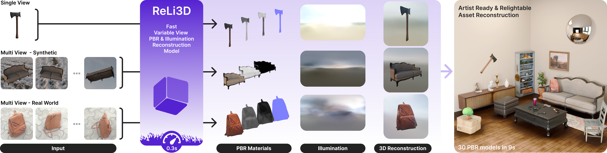

# ReLi3D

<p align="left">
  <strong>
    Relightable Large Reconstruction from Multi-View Images
  </strong>
</p>

<p align="center">
  
</p>

<p align="center">
  <span><a href="https://reli3d.jdihlmann.com/">Project Page</a></span>&nbsp;&nbsp;&nbsp;
  <span><a href="https://huggingface.co/StabilityLabs/ReLi3D">Model (Hugging Face)</a></span>&nbsp;&nbsp;&nbsp;
  <span><a href="https://github.com/Stability-AI/ReLi3D">Code</a></span>
</p>

## About

ReLi3D is an inference-only release for relightable 3D asset reconstruction.

Given a set of object images and camera poses (`transforms.json` + RGBA frames), ReLi3D predicts a UV-unwrapped textured mesh with material attributes and estimated illumination.

Training and experiment pipelines are intentionally excluded from this repository.

## Repository Layout

- `demos/reli3d/infer_from_transforms.py`: Main inference entrypoint.
- `configs/reli3d/inference.yaml`: Runtime system config.
- `scripts/download_model_from_hf.py`: Explicit model artifact downloader.
- `src/`: Runtime model components used for inference.
- `native/`: Native extensions (`uv_unwrapper`, `texture_baker`).
- `artifacts/model/`: Local model artifacts (`config.yaml`, `reli3d_final.ckpt`).

## Installation

```bash
git clone https://github.com/Stability-AI/ReLi3D.git
cd ReLi3D

python3.10 -m venv .venv
source .venv/bin/activate

pip install --upgrade pip
pip install -r requirements.txt
pip install ./native/uv_unwrapper ./native/texture_baker
```

## Model Artifacts

Default model source: `StabilityLabs/ReLi3D` on Hugging Face.

If the model repo is private or gated, authenticate first:

```bash
huggingface-cli login
git config --global credential.helper store
```

Download artifacts explicitly:

```bash
python scripts/download_model_from_hf.py \
  --repo-id StabilityLabs/ReLi3D \
  --output-dir artifacts/model
```

Selective download:

```bash
# Only config
python scripts/download_model_from_hf.py --skip-checkpoint

# Only checkpoint
python scripts/download_model_from_hf.py --skip-config
```

`demos/reli3d/infer_from_transforms.py` also auto-downloads missing default artifacts during inference.

Resolution order for checkpoint:

1. `--checkpoint`
2. `RELI3D_CHECKPOINT`
3. `artifacts/model/reli3d_final.ckpt`

Default config path:

- `artifacts/model/config.yaml` (falls back to `artifacts/model/raw.yaml` if present)

## Input Format

Each object under `--input-root` must contain:

- `transforms.json`
- `rgba/<view>.png`

Example:

```text
demo_files/objects/
  Camera_01/
    transforms.json
    rgba/
      0000.png
      0010.png
      0021.png
      0031.png
```

Expected `transforms.json` frame keys:

- `file_path`
- `transform_matrix` (or `camera_transform`)
- `camera_fov`
- optional `camera_principal_point`

## Quickstart

```bash
python demos/reli3d/infer_from_transforms.py \
  --input-root demo_files/objects \
  --objects Camera_01 \
  --output-root outputs \
  --num-views 4 \
  --texture-size 256 \
  --overwrite
```

## Exact Final-Run Parity

If you want strict parity with your exact final run setup, pass explicit artifact paths:

```bash
python demos/reli3d/infer_from_transforms.py \
  --input-root demo_files/objects \
  --objects Camera_01 \
  --config /path/to/raw.yaml \
  --checkpoint /path/to/epoch=0-step=80000.ckpt \
  --output-root outputs \
  --overwrite
```

## Outputs

Per object output directory:

- `outputs/<object>/mesh.glb`
- `outputs/<object>/illumination.hdr` (if predicted)
- `outputs/<object>/run_info.json`

`run_info.json` stores repo-relative or filename-only paths to avoid leaking internal absolute filesystem paths.

## License

This code and model usage are subject to Stability AI Community License terms.

For individuals or organizations generating annual revenue of USD 1,000,000 (or local currency equivalent) or more, commercial usage requires an enterprise license from Stability AI.

- License details: https://stability.ai/license
- Enterprise request: https://stability.ai/enterprise

## Citation

Citation information will be added with the public paper release.

